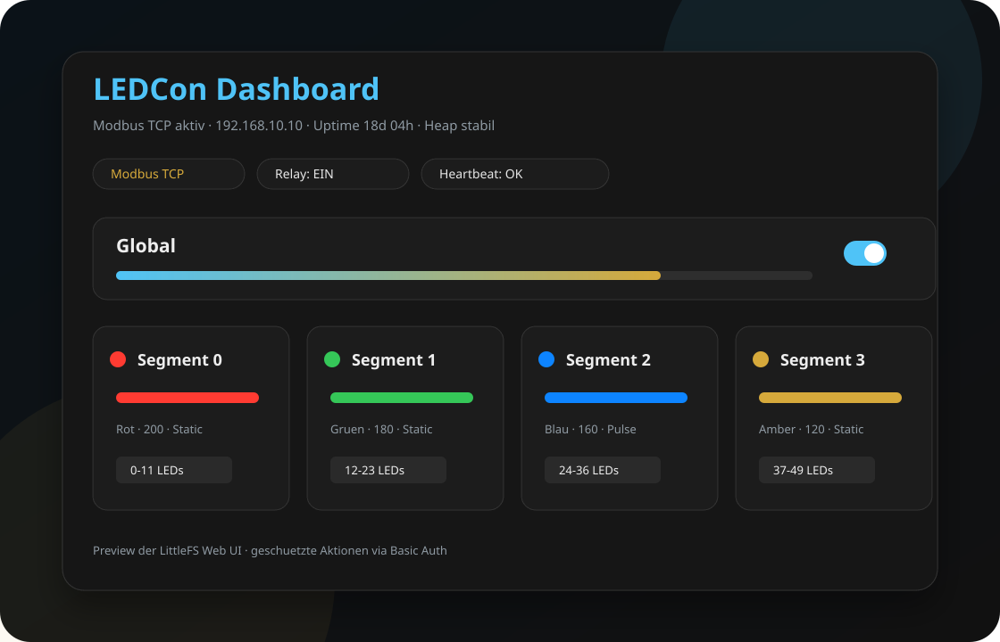
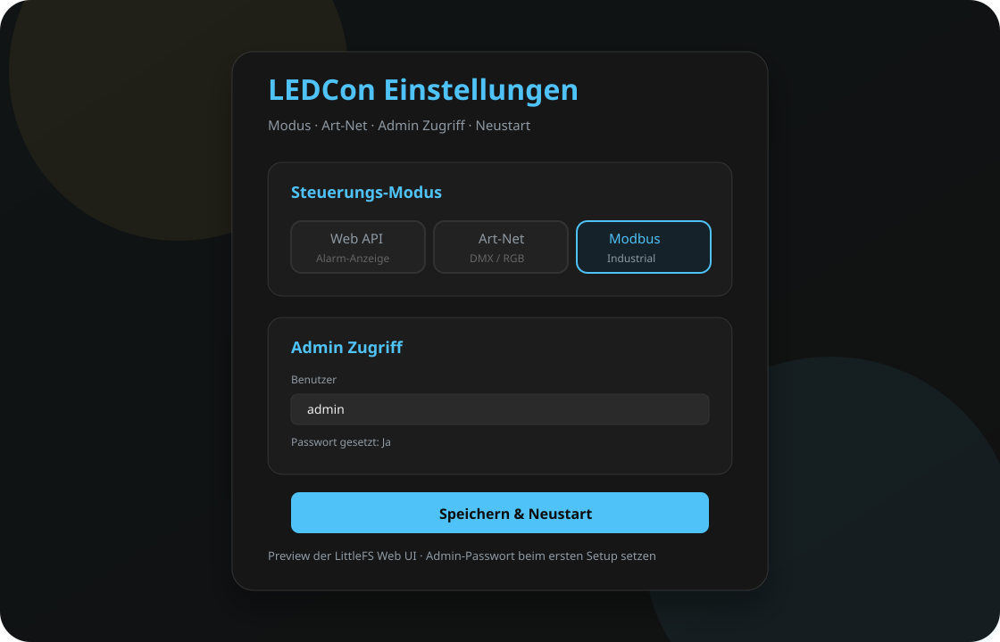

# LEDCon

Industrieller ESP32 LED-Controller fuer WS2812B/NeoPixel-Installationen auf dem
**Gledopto Elite 2D-EXMU**. Die Firmware steuert segmentierte LED-Streifen ueber
**Modbus TCP**, **Art-Net** oder eine lokale **Weboberflaeche / REST API**.

Der Fokus liegt auf stabiler Dauerlauf-Nutzung: Modbus TCP ist der Standardmodus,
statische LED-Zustaende werden nicht unnoetig neu gerendert, Schreibvorgaenge
werden validiert und bei Modbus-Ausfall werden LEDs sicher ausgeschaltet.


---

## Vorschau

| Dashboard | Einstellungen |
|---|---|
|  |  |


---

## Kernfunktionen

- **Modbus TCP als Primaermodus**
- **8 konfigurierbare LED-Segmente**
- **Art-Net / DMX over UDP** fuer RGB-Dimmer-Gruppen
- **Web API Modus** fuer segmentbasierte REST-Steuerung mit geschütztem API-Endpunkte
- **Bis 300 WS2812B LEDs** ueber RMT-Ausgabe
- **Ethernet** oder **WLAN** mit DHCP oder statischer IP
- **OTA Firmware Upload** über die Weboberfläche
- **Web UI** fuer Dashboard, Netzwerk, LEDs, Einstellungen und Hilfe

---

## Hardware

| Bauteil | Wert |
|---|---|
| Board | Gledopto Elite 2D-EXMU / GL-C-618WL |
| MCU | ESP32, 240 MHz |
| Ethernet | LAN8720 RMII, PoE-faehig |
| LED-Ausgang | GPIO16 |
| LED-Typ | WS2812B / NeoPixel |
| LED-Maximum | 300 Pixel |
| Relais | GPIO18, LED-Netzteil ein/aus |

---

## Schnellstart

### Voraussetzungen

- PlatformIO CLI oder PlatformIO VSCode Extension
- USB-C/USB-Serial Verbindung zum Controller
- CH340/CH34x Treiber, falls der Adapter diesen Chip nutzt

### Firmware bauen und flashen

```bash
pio run -e ledcon_hw
pio run -e ledcon_hw -t upload
pio run -e ledcon_hw -t uploadfs
```

---

## Erstinbetriebnahme

| Einstellung | Standard |
|---|---|
| Modus | Modbus TCP |
| Ethernet IP | `192.168.10.10` |
| Subnetz | `255.255.255.0` |
| Gateway | `192.168.10.1` |
| Access Point | `LEDcon` |
| AP Passwort | `LEDcon-Setup` |
| AP IP | `192.168.10.1` |
| Web UI | `http://192.168.10.10` oder `http://192.168.10.1` |
| Admin Benutzer | `admin` |
| Admin Passwort | Muss beim ersten Setup gesetzt werden |

Ablauf:

1. Controller per Ethernet verbinden oder mit dem AP `LEDcon` verbinden.
2. Web UI oeffnen.
3. Unter **Einstellungen** ein Admin-Passwort setzen.
4. Unter **Netzwerk** DHCP oder statische IP konfigurieren.
5. Unter **LED Setup** LED-Anzahl und Segmente pruefen.
6. Nach Änderungen an Netzwerk/LED Setup startet der Controller neu.

---

## Weboberflaeche

| Seite | Pfad | Zweck |
|---|---|---|
| Dashboard | `/` | Status, Globalsteuerung, Segmente, Test-Override |
| Netzwerk | `/net.html` | Ethernet, WiFi Client, Access Point, Modbus Port |
| LED Setup | `/leds.html` | LED-Anzahl und Segmentbereiche |
| Einstellungen | `/settings.html` | Modus, Art-Net Konfiguration, Admin-Passwort |
| Hilfe | `/help.html` | API, Modbus-Tabelle, Art-Net, OTA Upload |

Geschuetzte Aktionen benoetigen Basic Auth. Die Weboberflaeche speichert die
Zugangsdaten nur in der Browser-Session.

---

## Modbus TCP

| Parameter | Wert |
|---|---|
| Port | `502` |
| Unit ID | `1` |
| Function Codes | FC03, FC06, FC16 |
| Max. Read Count | 125 Register |
| Max. Write Count | 64 Register |

### Register

| Register | Name | Bereich | Zugriff |
|---|---|---|---|
| 0 | Global Enable | 0/1 | R/W |
| 1 | Global Brightness | 0-255 | R/W |
| 2 | Anzahl Segmente | 1-8 | R |
| 3 | Heartbeat / Watchdog Kick | beliebiger Wert | W |
| 10 + n x 10 | Segment n Rot | 0-255 | R/W |
| 11 + n x 10 | Segment n Gruen | 0-255 | R/W |
| 12 + n x 10 | Segment n Blau | 0-255 | R/W |
| 13 + n x 10 | Segment n Helligkeit | 0-255 | R/W |
| 14 + n x 10 | Segment n Effekt | 0-8 | R/W |
| 15 + n x 10 | Segment n Aktiv | 0/1 | R/W |

Segment-Basisadressen:

| Segment | Basis |
|---|---|
| 0 | 10 |
| 1 | 20 |
| 2 | 30 |
| 3 | 40 |
| 4 | 50 |
| 5 | 60 |
| 6 | 70 |
| 7 | 80 |

Effekte:

| Wert | Effekt |
|---|---|
| 0 | Aus |
| 1 | Statisch |
| 2 | Flash schnell |
| 3 | Flash langsam |
| 4 | Pulse schnell |
| 5 | Pulse langsam |
| 6 | Strobe |
| 7 | Pulse mittel |
| 8 | Chase |

Beispiel: Segment 0 statisch rot setzen.

```text
FC16
Adresse: 10
Anzahl:  6
Daten:   255, 0, 0, 200, 1, 1
```

Heartbeat-Beispiel:

```text
FC06
Adresse: 3
Wert:    1
Intervall: 1-5 s
```

---

## Art-Net

| Parameter | Wert |
|---|---|
| UDP Port | `6454` |
| Universe | konfigurierbar, Standard `0` |
| Gruppengroesse | konfigurierbar, Standard `3` LEDs |
| Kanaele pro Gruppe | 4 |

Kanalbelegung pro Gruppe:

| Kanal | Funktion |
|---|---|
| 1 | Rot |
| 2 | Gruen |
| 3 | Blau |
| 4 | Master-Dimmer |

Der Dimmer skaliert die RGB-Werte: `0` ist aus, `255` ist volle Helligkeit.

---

## REST API

Basis-URL im Standardnetz:

```text
http://192.168.10.10
```

| Methode | Pfad | Beschreibung |
|---|---|---|
| GET | `/api/status` | Status, IP, Uptime, Heap, Modus, Segmente |
| GET | `/api/cfg` | Vollstaendige Konfiguration, geschuetzt |
| POST | `/api/auth` | Admin-Benutzer/Passwort setzen |
| POST | `/api/seg?n=0` | Segment patchen, geschuetzt |
| POST | `/api/global` | Global Enable/Helligkeit setzen, geschuetzt |
| POST | `/api/relay` | Relais schalten, geschuetzt |
| POST | `/api/mode` | Modus wechseln, geschuetzt, Neustart |
| POST | `/api/net` | Netzwerk speichern, geschuetzt, Neustart |
| POST | `/api/leds` | LED Setup speichern, geschuetzt, Neustart |
| POST | `/update` | OTA Firmware Upload, geschuetzt |

Beispiel:

```bash
curl -u admin:PASSWORT \
  -H 'Content-Type: application/json' \
  -X POST 'http://192.168.10.10/api/seg?n=0' \
  -d '{"r":255,"g":0,"b":0,"bri":200,"fx":1,"en":true}'
```